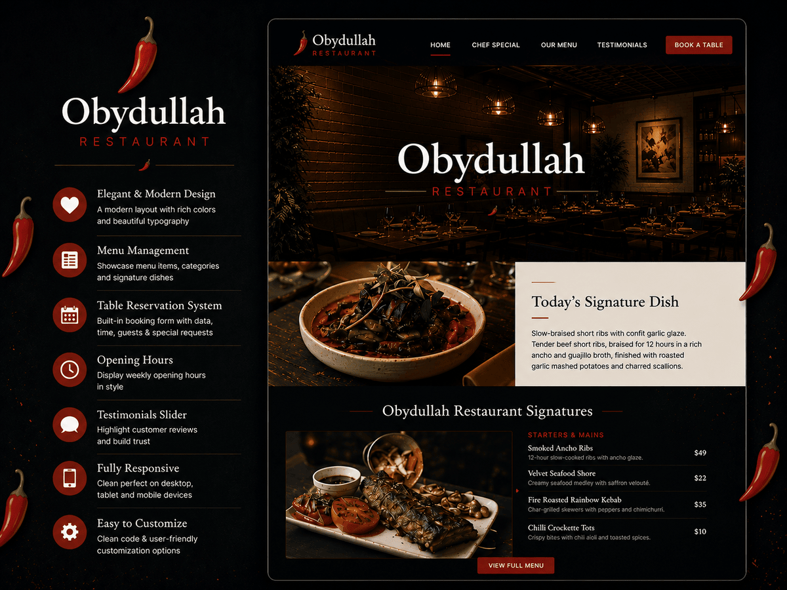

# Velvet Chili Restaurant

A modern, responsive WordPress theme designed for restaurants, cafes, and culinary businesses. Built with performance, accessibility, and clean design in mind.




---

## Features

- **Fully responsive** — mobile, tablet, and desktop layouts
- **Dual-mode architecture** — works standalone with static content, or dynamically with the companion plugin
- **Hero image slider** — autoplay, keyboard nav, touch swipe, pause on hover
- **Chef's Special** — featured dish highlight section
- **Menu preview** — price cards with descriptions and CTA
- **Testimonials carousel** — auto-rotating customer quotes
- **Reservation form** — AJAX booking with client-side validation
- **About page** — chef story, philosophy, event image slider
- **Contact page** — Contact Form 7 integration, address, phone, map
- **Full menu page** — items grouped by category with prices
- **Blog** — full loop with pagination, single post view, comments, sidebar
- **Accessibility** — ARIA labels, keyboard navigation, `prefers-reduced-motion`, skip links
- **SEO-friendly** — semantic HTML5, proper heading hierarchy, alt text
- **Customizer support** — phone number and opening hours settings
- **Translation-ready** — all strings wrapped for i18n (text domain: `velvet-chili-restaurant`)
- **Lightweight** — no build tools, no frameworks, minimal JS

---

## Requirements

| Dependency    | Version |
| ------------- | ------- |
| WordPress     | 7.0+    |
| PHP           | 8.5+    |
| MySQL/MariaDB | 5.7+    |

---

## Installation

1. Download or clone this repository
2. Copy the `velvet-chili-restaurant` folder to `/wp-content/themes/`
3. Activate the theme via **Appearance → Themes** in WordPress admin
4. Install recommended plugins when prompted (see below)

```bash
# Or via WP-CLI
wp theme install velvet-chili-restaurant --activate
```

---

## Recommended Plugins

| Plugin                                                                                    | Purpose                                                                                                          | Required?                              |
| ----------------------------------------------------------------------------------------- | ---------------------------------------------------------------------------------------------------------------- | -------------------------------------- |
| [**Obydullah Restaurant Core**](https://wordpress.org/plugins/obydullah-restaurant-core/) | Custom post types for menu items, testimonials, hero slides, opening hours, booking system, and section settings | Optional (theme works without it)      |
| [**Contact Form 7**](https://wordpress.org/plugins/contact-form-7/)                       | Contact form on the Contact page                                                                                 | Optional (auto-detects first CF7 form) |

### About the Dual-Mode Architecture

The theme is designed to work in two modes:

- **Without plugins:** All front-page sections render with beautiful static placeholder content. The theme is fully functional on activation.
- **With plugins:** Install the Obydullah Restaurant Core plugin to manage content via WordPress admin — hero slides, menu items, testimonials, opening hours, and more become CMS-editable.

The theme auto-detects the plugin via a PHP constant (`OBIRC_VERSION`) and switches rendering mode automatically.

---

## Custom Page Templates

After activation, create pages and assign these templates via **Page Attributes → Template**:

| Template         | Slug           | Description                                                            |
| ---------------- | -------------- | ---------------------------------------------------------------------- |
| **About Page**   | `page-about`   | Chef story, restaurant philosophy, event image slider                  |
| **Contact Page** | `page-contact` | Contact Form 7, address/phone/email, map embed                         |
| **Full Menu**    | `page-menu`    | All menu items grouped by category (Starters, Mains, Desserts, Drinks) |

---

## Theme Setup

### Menus

1. Go to **Appearance → Menus**
2. Create a menu and assign it to the **Primary Menu** location
3. If no menu is assigned, a fallback menu with section anchors is rendered

### Blog

1. Go to **Settings → Reading**
2. Set **Your homepage displays** to "A static page"
3. Select a **Posts page** for the blog

### Customizer

Go to **Appearance → Customize → Contact Info**:

- Phone Number
- Opening Hours

---

## File Structure

```
velvet-chili-restaurant/
├── style.css                  # Theme declaration + comment/post-nav styles
├── functions.php              # Asset enqueuing, theme setup, customizer, admin notice
├── header.php                 # Site header + navigation
├── footer.php                 # Site footer (static + plugin-dynamic)
├── front-page.php             # Homepage (composes template-parts)
├── home.php                   # Blog page
├── index.php                  # Fallback template
├── page.php                   # Default page template
├── single.php                 # Single post
├── archive.php / tag.php      # Archive templates
├── search.php / 404.php       # Search + error pages
├── comments.php / sidebar.php # Comments + widget area
├── page-about.php             # About Page template
├── page-contact.php           # Contact Page template
├── page-menu.php              # Full Menu template
│
├── template-parts/            # Reusable section components
│   ├── hero-section.php       # Hero image slider
│   ├── chef-special.php       # Featured dish section
│   ├── our-menu.php           # Menu preview section
│   ├── testimonials.php       # Customer testimonials carousel
│   ├── reservation.php        # Booking form + opening hours
│   ├── content.php            # Blog post card
│   └── blog-posts.php         # Blog index fallback
│
├── assets/
│   ├── css/                   # base.css + theme.css (BEM, CSS custom properties)
│   ├── js/                    # main.js (sliders/nav) + booking.js (AJAX form)
│   ├── images/                # Hero, chef, menu, testimonial images
│   └── vendor/fontawesome/    # Font Awesome 7.2.0 (locally vendored)
│
└── documents/
    └── velvet-chili-html/     # Original static HTML prototype
```

---

## Customization

### Colors & Typography

Edit CSS custom properties in `assets/css/base.css`:

```css
:root {
  --color-chili-red: #b91c1c;
  --color-vcr-burgundy: #7f1a1a;
  --color-cream: #f9f1e7;
  --color-soft-black: #1a1a1a;
  --color-border: #e2d5c7;
  --font-heading: "Cormorant Garamond", serif;
  --font-body: "Montserrat", sans-serif;
}
```

### Images

Replace files in `assets/images/`:

- `hero.jpg` — Hero section background
- `chef-special.jpg` — Chef's Special image
- `our-menu.jpg` — Menu section background
- `testimonial.jpg` — Testimonials background
- `about-1.jpg` / `about-2.jpg` / `about-3.jpg` — About page event slider

### Adding Front-Page Sections

1. Create `template-parts/your-section.php`
2. Implement the dual-mode pattern (CPT query + static fallback)
3. Add to `front-page.php`: `<?php get_template_part('template-parts/your', 'section'); ?>`
4. Add BEM-styled CSS to `assets/css/theme.css`

---

## Changelog

### 1.0.2

- Updated to current stable version
- Comment and post navigation styles added to `style.css`
- Admin notice for plugin recommendations

### 1.0.1

- Refactored template structure
- Added alternate CSS/JS assets
- Static HTML prototype archived in `documents/`

### 1.0.0

- Initial release
- Core theme features implemented
- Dual-mode architecture (static + plugin)
- Customizer settings
- Responsive layout
- Accessibility features

---

## Links

- **Theme Page:** https://obydullah.com/project/velvet-chili-restaurant-wordpress-theme
- **GitHub:** https://github.com/shaik-obydullah/velvet-chili-restaurant-wordpress-theme
- **Companion Plugin:** https://wordpress.org/plugins/obydullah-restaurant-core/

---

## Credits

- [Font Awesome 7.2.0](https://fontawesome.com) — Icons (locally vendored)
- [Google Fonts](https://fonts.google.com) — Cormorant Garamond & Montserrat
- [Obydullah Restaurant Core](https://wordpress.org/plugins/obydullah-restaurant-core/) — Companion CPT plugin
- [Contact Form 7](https://wordpress.org/plugins/contact-form-7/) — Contact form integration

---

## License

Licensed under the [GNU General Public License v2.0 or later](https://www.gnu.org/licenses/gpl-2.0.html). All bundled assets follow their respective licenses.
